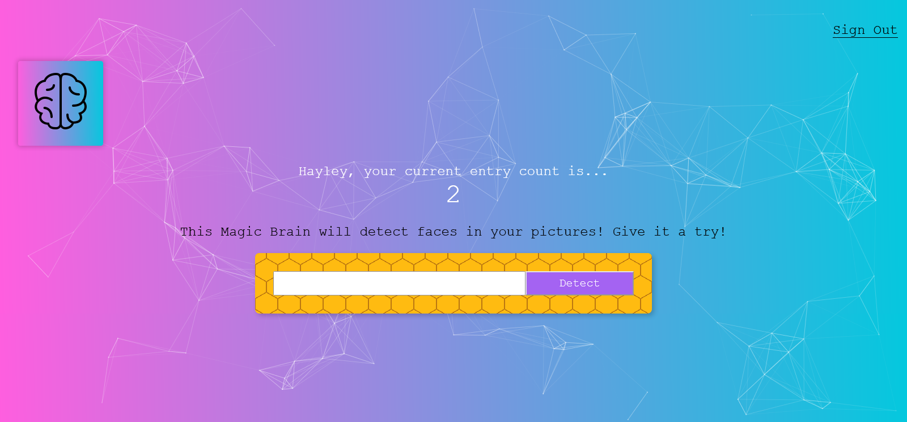

# Smart Brain Project

## Table of Contents
- [Overview](#overview)
  - [Website Link](#website-link)
- [Installation](#installation)
  - [Install Dependencies](#install-dependencies)
- [Technologies Used](#technologies-used)
- [Screenshots](#screenshots)
- [Future Work / Things to Fix](#future-work--things-to-fix)

## Overview

Application that allows a user to sign in or create an account and upload an
image for a single face to be detected.

### Website Link

- [Smart Brain Project](https://haylz-smart-brain.herokuapp.com/)
- [Backend of Project](https://github.com/HaylzRandom/smart-brain-api)

## Installation

### Install Dependencies

In your terminal run either `yarn` or `npm install` to build all the
dependencies in the project.

## Technologies Used

- React
- [React Particles](https://www.npmjs.com/package/react-particles-js)
- [React Parallax Tilt](https://www.npmjs.com/package/react-parallax-tilt)
- [Clarifai API - Face Recognition](https://www.clarifai.com/models/ai-face-detection)
- [Tachyons](https://tachyons.io/)

## Screenshots

Main page of website

Register a User

Linking to image to detect face

## Future Work / Things to Fix

- [ ] Display error messages when logging in / registering user
- [ ] Detect multiple faces
